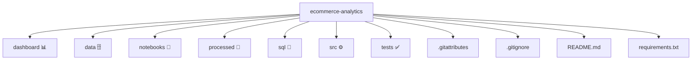

# 🛒 Ecommerce Analytics — Data Case

**Problema:** entender e prever vendas de uma loja (faturamento, ticket médio, teste A/B).  
**Entregável:** pipeline de dados (ETL) + análises estatísticas + modelos preditivos + dashboard (Excel).  
**História:** *“Como eu usei dados de vendas para descobrir insights sobre compradores.”*
**Tecnologias:** Python, SQL, Excel

---

## 📂 Estrutura do projeto

---

## 📓 Notebooks

- **01_eda.ipynb** — análise exploratória: nulos, outliers, distribuições, correlações, gráficos.  
- **02_estatistica.ipynb** — intervalos de confiança, t-test A/B, qui-quadrado, correlações (Pearson/Spearman).  

---

## 🛠️ Stack

- **Python:** pandas, matplotlib 
- **PostgreSQL:** DDL, CTEs, funções janela, views  
- **Excel:** dashboards interativos e KPIs  

